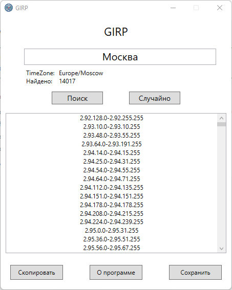

# GIRP
Get Ip Range Pro - поможет вам получить диапазоны ip-адресов необходимого вам города из любой страны.

Возможности:
- Экспорт ip диапазонов в .txt
- Копирование ip диапазонов в буфер обмена
- Возможность рандомного выбора любого города в любой стране
- Возможность выбрать нужный вам город из множества других при их нахождении
- Выбрать нужную вам версию программы x64 или x86
- Портабельность (отсутствие внешних зависимостей для запуска программы)

Сборка Self-contained

Powered by 4it.me
SVG ICON from - svgrepo.com

